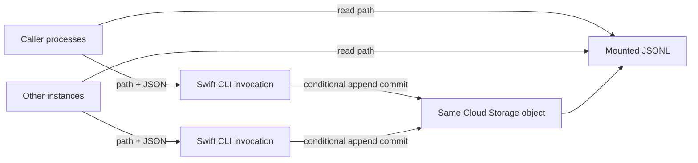

# Ledger

## Purpose and Scope

Provide one short-lived Swift executable that appends JSONL safely while independent callers
continue running concurrently. Reading and interpreting JSONL belong to callers.
The CLI treats JSON objects as opaque; callers own schema and application semantics.

This is the independent system and Swift package design root; parent: none. Its internal child is [Append](Sources/LedgerCLI/Append/DESIGN.md). Existing
runtime/application designs remain authorities for their implementations. The
storage transport uses object-generation preconditions; the mounted filesystem
does not supply distributed locking.

## Responsibilities and Boundaries

| Owner | Contract |
|---|---|
| Caller | Read paths, interpret records, create payload and stable operation ID |
| CLI | Validate record framing, append atomically, handle contention/retries, report outcome |
| Runtime owner | Install executable, supply trusted storage mapping and workload identity |
| Storage | Arbitrate writes to the same object and publish complete object generations |

The synchronization key is the resolved file, not caller process or application entity.
Independent files remain independent. Reading several logs does not acquire
locks and does not create a multi-file transaction.

## Related Designs

| Design | Relationship | Contract Used |
|---|---|---|
| [Append](Sources/LedgerCLI/Append/DESIGN.md) | child | Input framing, path mapping, conditional append and bounded transport |

Consumers own workload configuration, mounted storage, payload semantics and
application-specific projections. No consumer application's schema or lifecycle
is part of Ledger's public contract.

## Architecture



The caller-facing interface is a local command taking a filesystem path. There is
no daemon, HTTP listener, MCP service, Firestore dependency or language-runtime
dependency for the binary. Reading requires no CLI command.

### Storage decision and its reason

The existing cloud mount is Cloud Storage FUSE. It provides file access but not
distributed `flock`/`fcntl` locking. Local lock files do not coordinate separate
Cloud Run instances. Plain shared `>>` cannot establish the required contract.

Selected cloud implementation: keep mounted path reads, but let the CLI commit
writes using the Cloud Storage JSON REST API's generation precondition. Use
Swift Foundation/Networking directly, without a Storage SDK. Runtime-owned
mount configuration maps the given path to the existing bucket/object. No new
storage resource is required.

This is an explicit qualification to filesystem-only access: safe same-object
writes use a provider atomic primitive internally. The user authorized implementation after this transport was explicitly proposed. A process-local lock cannot substitute for this guarantee.

## Contracts and Invariants

### CLI and records

```text
ledger append <absolute-jsonl-path> --id <operation-uuid> < record.json
```

`record.json` contains one UTF-8 JSON object. The CLI validates syntax, input
size and one-record framing, not the payload's domain schema. Reject duplicate
keys and malformed UTF-8; preserve JSON scalar values without floating-point
round trips. JSON string newlines are escaped, never physical JSONL line breaks.

Each stored line has this envelope:

| Field | Owner and purpose |
|---|---|
| `id` | Caller-chosen operation UUID, retained unchanged on retry |
| `hash` | CLI-computed SHA-256 of the exact accepted input bytes |
| `data` | Caller-provided JSON object, opaque to the CLI |

Input must be a single physical JSON line, optionally followed by one LF. Strip
only that optional LF for hashing/storage; reject whitespace outside the root object and preserve all accepted bytes. Payload nesting is bounded to 64 levels (root depth zero; all values have depth below 64); the storage envelope adds one level. The CLI
adds the envelope and final LF without decoding/re-encoding numeric values.
The `data` field remains ordinary readable JSON. There is no CLI-assigned application
index, timestamp, entity identity or semantic merge.

All records belonging to one logical addition may be grouped by the caller in
one payload. The CLI treats the whole payload as one atomic append.

### Commit guarantees

- Successful appends to one object have a single storage commit order.
- No successful append removes an earlier committed line.
- Competing records never interleave bytes.
- The cloud object exposes complete generations, not a half-uploaded record.
- Repeating one ID with the same bytes confirms the existing commit; changing
  its bytes returns `id_conflict`.
- Only append is supported. No truncate, replace, delete, graph merge or compaction.
- Guarantees require every writer to follow this protocol. Existing writable
  mounts and shared workload credentials do not prevent deliberate bypass.

### Output and errors

Success writes one JSON result to stdout: `status` (`appended` or `already_present`),
`id` and the confirmed object `generation` as a string. Exit status is zero only
for a confirmed commit. Diagnostics go to stderr without payloads or credentials.

| Exit | Code | Meaning and caller action |
|---|---|---|
| 2 | `invalid_input` / `invalid_path` | Nothing written; correct input |
| 3 | `id_conflict` / `invalid_log` | Stop; do not repair or overwrite implicitly |
| 4 | `contention` | Only precondition failures observed; retry same ID/input |
| 5 | `access_denied` / `io_error` / `limit_exceeded` | Explicit failure; no alternate storage fallback |
| 6 | `outcome_unknown` | Upload might have committed; retry identical ID/input |

Any uncertain request not subsequently resolved takes precedence over a later
error code: do not report definitely-uncommitted failure after an ambiguous upload.

## Runtime Flows

1. Validate path and bounded stdin before issuing a mutation.
2. Resolve bucket/object using trusted mount configuration.
3. Read current generation and generation-pinned bytes via the REST API. Retry
   if the selected generation disappears. A genuinely absent object is empty.
4. Validate JSONL framing/envelopes and check the operation ID. Equal ID/hash
   returns success; unequal hash returns a conflict.
5. Construct `existing bytes + complete envelope line + LF`.
6. Upload with `ifGenerationMatch=<observed generation>`; use `0` for creation.
7. A successful response confirms commit. HTTP 412 means another writer won:
   reread and repeat with the same ID/input under the invocation deadline.
8. After timeout/disconnect during upload, reread and check the ID before another
   attempt. Return `outcome_unknown` if the deadline prevents confirmation.

```text
A reads v7 ── commits record A as v8
B reads v7 ── write rejected ── reads v8 ── commits A + B as v9
```

There is no lock owner, lock expiry or lock cleanup. This is optimistic write
serialization, not a critical section that blocks a caller during computation.
Process termination before commit leaves the object unchanged; termination after
commit but before acknowledgment is resolved by the stable operation ID.

Mounted readers may retain an older view through caching. They are not part of
the write protocol and do not acknowledge commits. Partial local read buffers or
stale mounted descriptors are not promised to be fresh transactional snapshots;
Readers must handle read errors. No cross-file snapshot guarantee exists.

## State, Ownership, and Lifecycle

SwiftPM builds a standalone Linux amd64 executable using a pinned stable Swift
toolchain and matching Static Linux SDK. Copy it into the Runtime Worker image
and place it on PATH as `ledger`. It inherits normal process input/output and exits after
one operation. No TypeScript library is required for invocation.

Use Foundation for files/JSON and FoundationNetworking for bounded HTTPS.
Use a maintained portable SHA-256 implementation, pinning its package version;
do not implement cryptography. The Cloud Run metadata service supplies a short-
lived access token for the existing workload identity. Keep it in memory and
never log it. Provider endpoints are fixed; disable credential-bearing redirects.
The container must include CA certificates.

CLI arguments contain only the file path and operation ID. Accept normalized
absolute `.jsonl` paths inside configured mounts; reject traversal and symlink
aliases. Configuration is installed by the runtime owner, not read from caller-
writable data files. The mapping allows independent files within the configured mount.

The bucket and mount root must be explicitly supplied in trusted configuration. Local
filesystem correctness is not proof for Cloud Storage. A future local backend
must have a separately tested crash/locking contract; it is not silently selected
when cloud configuration or credentials are missing.

## Failure, Concurrency, and Constraints

The first implementation reads and rewrites the bounded whole file per attempt.
Its I/O and memory cost is O(file bytes), with retries multiplying that cost.
No composition API, segmentation or index service is introduced in this version.

The deployment owner sets positive maximum record bytes, file bytes, attempts
and wall-clock duration. The same deadline bounds authentication, downloads,
uploads, backoff and reconciliation. Enforce file limits from metadata and actual
streamed bytes, and reject oversized candidate output before upload. Select
values from measured current files and the container's memory/time envelope
before release; no production capacity claim is made by this design.

## Verification and Change Impact

| Proof obligation | Required execution evidence |
|---|---|
| Same-file contention | Independent processes forced to read one generation; both successful records retained |
| Cross-instance behavior | Two real Cloud Run executions append to the same disposable object |
| Retry identity | Repeated identical request creates one line; changed payload with same ID fails |
| Ambiguous result | Lose success response, then confirm the receipt without duplicate append |
| Creation race | Concurrent first writes preserve both records through create-if-absent retry |
| Atomic publication | Storage reads during upload return complete old or new generations |
| Bounded failures | Malformed input/log, denied access, contention and deadlines do not overwrite or loop indefinitely |
| Independent files | Writes to different paths are not serialized through a global lock |
| Runtime integration | Independent callers invoke the installed binary against a real shared object |

Every test uses a timeout. macOS tests, local file locks and fake storage tests
cannot replace the Cloud Run/GCS evidence. See [README](README.md#verification) for the exact evidence and remaining blockers.

Repository separation retains payload framing, conditional writes and error
feedback. Consumers must invoke `ledger append` and provide `LEDGER_CONFIG`;
any application-specific compatibility command belongs to that consumer.

### Provider evidence

- [FUSE limitations](https://docs.cloud.google.com/storage/docs/cloud-storage-fuse/overview):
  mounted filesystem access does not supply file locking.
- [Generation preconditions](https://docs.cloud.google.com/storage/docs/request-preconditions):
  mismatched writes fail with HTTP 412; zero permits create-if-absent.
- [Object atomicity and caching](https://docs.cloud.google.com/storage/docs/consistency):
  single-object operations are atomic; caching and unpinned ranged reads need care.

### Caller error feedback

Errors are one JSON object on stderr; numeric exit codes remain unchanged.
`code`, `message`, `retryAction`, `commitState`, and `stage` guide the caller.
Optional `location` identifies source (`input` or `log`), one-based line and
zero-based UTF-8 byte offset within that line. Optional `limit` and `actual`
are byte counts; streaming rejection reports the observed count, not total size.
No input fragments, credentials or raw provider errors appear in diagnostics.
`retry_same_request` requires the same operation ID and exact input bytes;
`correct_input` permits fixing a rejected input; `stop` requires operator action.
`not_written` describes this invocation only, not whether an earlier retry
committed. Unresolved uploads always report `unknown`; receipt-output failures
after confirmation report `committed`. JSON validation precedes authentication.

## Runtime Integration

This repository owns [Dockerfile](Dockerfile) and [binary CI](.github/workflows/build.yml).
The producer pins Swift 6.4.0 and its matching checksummed Static Linux SDK,
runs package tests, verifies the standalone Linux amd64 executable without
Swift installed, and exports the executable plus SHA-256 checksum. CI publishes
a commit-named archive. Consumers pin a source commit or its exact artifact and
verify the checksum before packaging it into their runtime image. Consumers
own image deployment, CA certificates, workload identity, mounted storage and
private `LEDGER_CONFIG` configuration. No moving latest artifact is selected.
